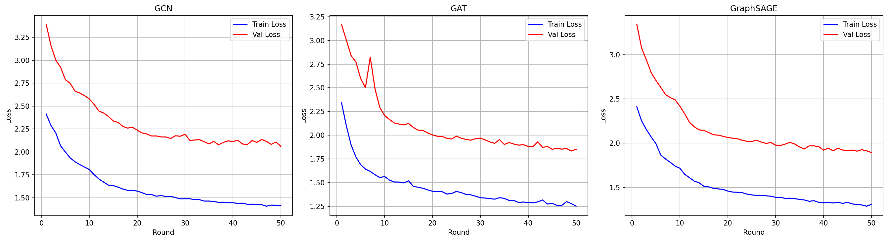
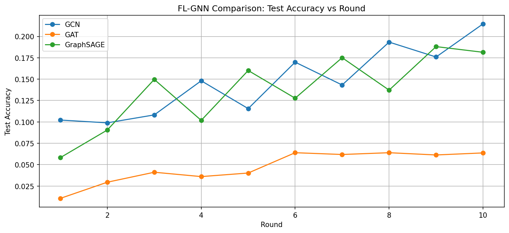
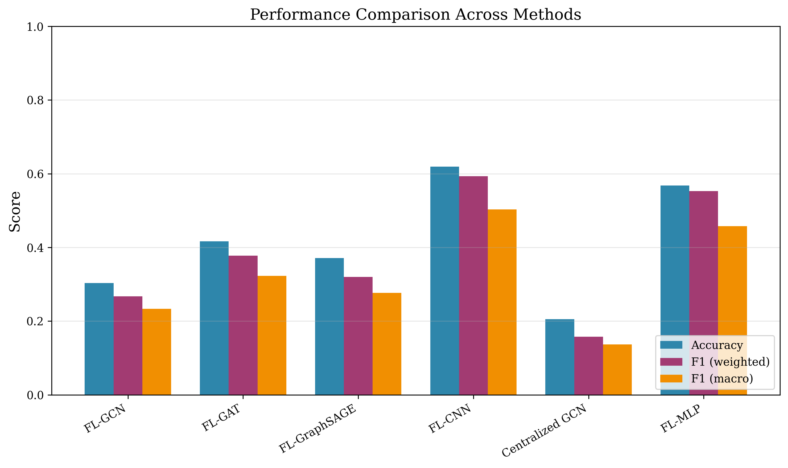
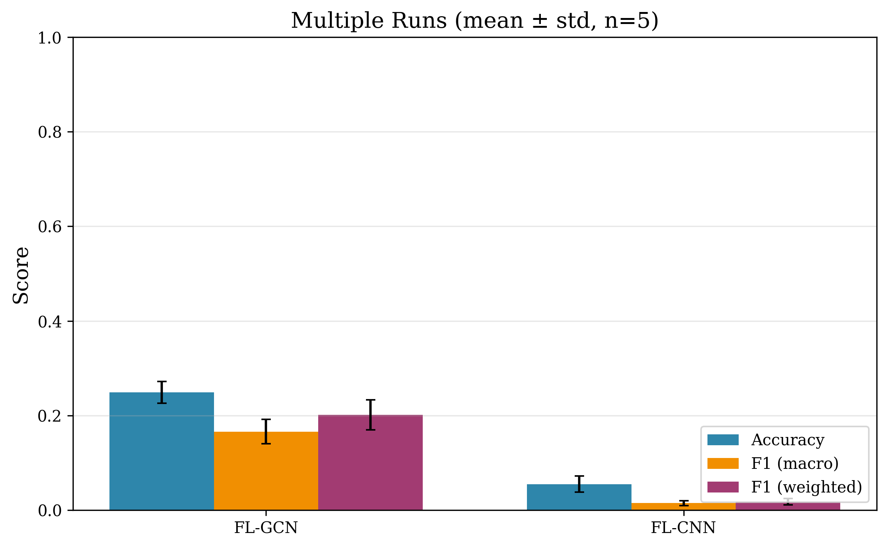
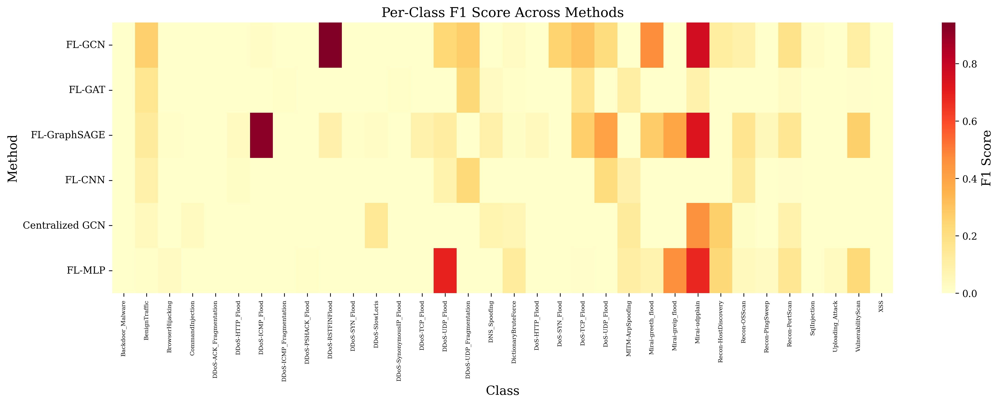
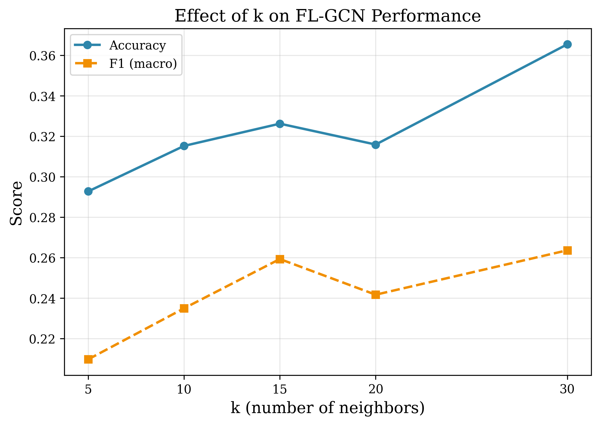
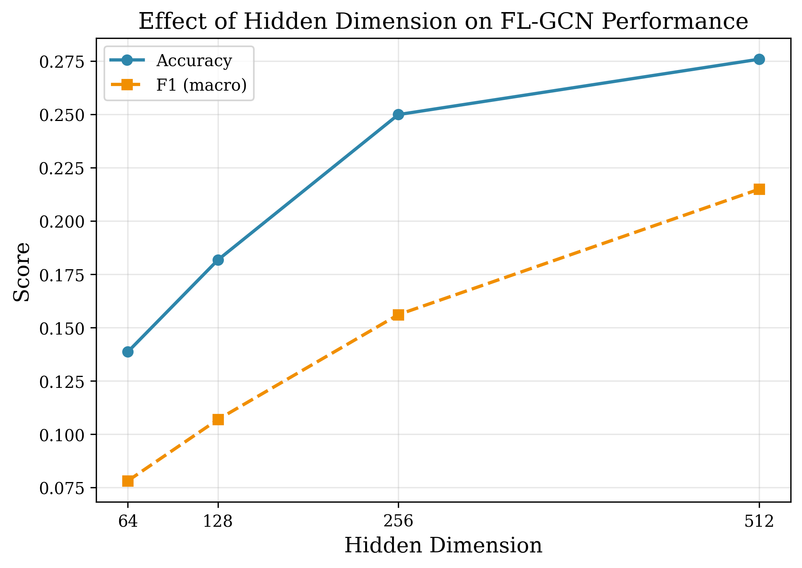
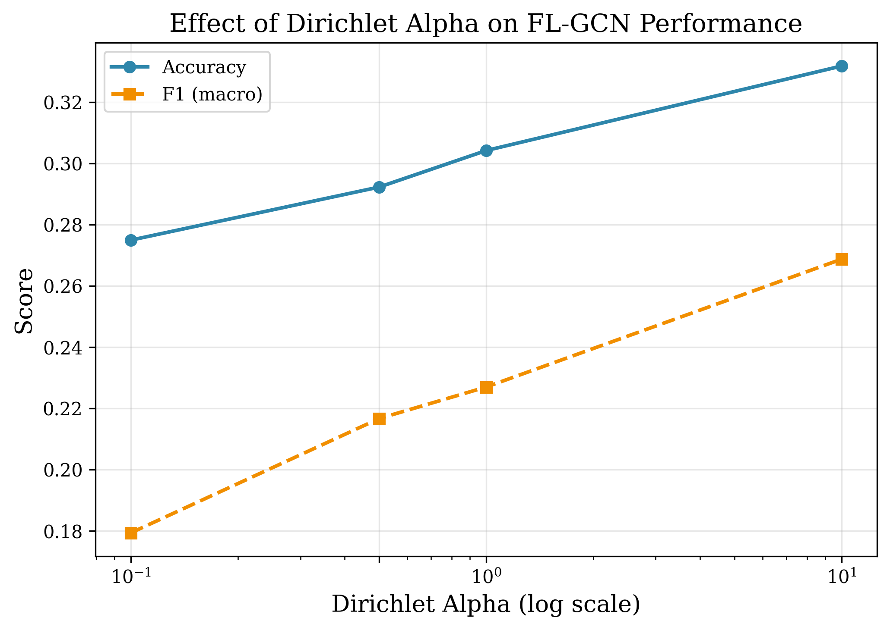
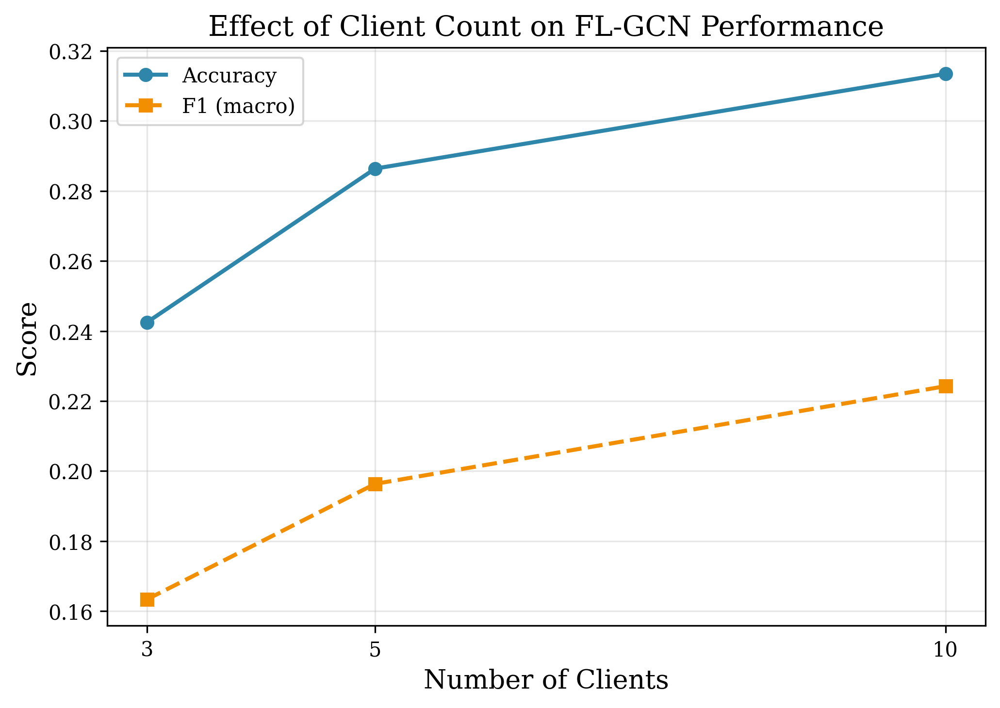

# FL-GNN-IDS: Federated Learning + Graph Neural Network for Intrusion Detection

[](https://www.python.org/downloads/)
[](https://pytorch.org/)
[](https://pyg.org/)

Federated Learning with Graph Neural Networks (GCN, GAT, GraphSAGE) for network intrusion detection on the **CICIoT2023** dataset. Implements manual FedAvg (no Flower simulation) to avoid Windows compatibility issues with Ray.

**Key findings:** With 5 clients and 10 FL rounds, FL-GCN achieves the best accuracy (24.9±2.3%) and macro F1 (16.6±2.6%) over 5 seeds. Graph-based models consistently outperform nongraph baselines (FL-CNN, FL-MLP, Centralized GCN). Results highlight the challenge of 34-class imbalanced IoT intrusion detection in federated non-IID settings.

## Dataset

This project uses the [**CICIoT2023**](https://www.unb.ca/cic/datasets/iotdataset-2023.html) dataset, a comprehensive and modern dataset designed for research in Internet of Things (IoT) security, particularly for intrusion detection and anomaly detection systems. Released by the Canadian Institute for Cybersecurity (CIC), this dataset reflects real-world IoT network traffic and attack scenarios, providing a valuable resource for machine learning and cybersecurity research.

The dataset was generated using a realistic testbed that simulates various IoT devices communicating over a network, including smart TVs, webcams, smart thermostats, and wearable devices. It captures both benign traffic and a wide variety of attack types such as Denial of Service (DoS), Distributed Denial of Service (DDoS), brute-force attacks, botnets, reconnaissance, and more advanced threats.

**Key features of CICIoT2023:**
- Contains a mix of normal and malicious IoT network traffic.
- Includes 34 distinct attack types, covering modern and advanced cyber threat scenarios.
- Provides labeled data suitable for supervised machine learning models.
- Offers extracted network flow features (e.g., packet size, duration, flags, statistical summaries) for traffic classification and anomaly detection.
- Supports research in intrusion detection, anomaly detection, and IoT security strategy development.

This dataset helps bridge the gap between traditional network security datasets and the unique, evolving patterns of IoT device communication, making it an excellent benchmark for evaluating the performance of AI-based security solutions.

The dataset was further cleaned and split into three parts by [**Himadri07 on Kaggle**](https://www.kaggle.com/datasets/himadri07/ciciot2023):

| Split | Rows | Usage |
|-------|------|-------|
| `train.csv` | 5,491,971 × 47 | Training |
| `validation.csv` | 1,176,851 × 47 | Validation |
| `test.csv` | 1,176,851 × 47 | Testing |

We credit Himadri07 for the time-consuming task of cleaning and restructuring the raw CICIoT2023 data — a contribution that made this work feasible.

In our pipeline, only `train.csv` is used for training and stratified sampling into federated client splits. `validation.csv` is not used — we reserve `test.csv` for final evaluation instead.

## Pipeline

```
CICIoT2023 CSV (5.4M × 47)
    ↓ 01_preprocessing.ipynb
Clean, scaled NPZ (44 features)
    ↓ 02_graph_construction.ipynb
Stratified sample ~96K → Dirichlet split → per-client k-NN graphs
    ↓ 03_federated_training.ipynb
Manual FedAvg: GCN / GAT / GraphSAGE (10 rounds, 3 local epochs)
    ↓ 04_evaluation.ipynb  +  05_comprehensive_analysis.ipynb
Metrics, plots, baselines, hyperparameter sweeps, statistical analysis
```

## Structure

```
fl-gnn/
├── notebooks/
│   ├── 01_preprocessing.ipynb              # Load CSV → clean → scale → save NPZ
│   ├── 02_graph_construction.ipynb         # Stratified sampling, Dirichlet split, k-NN graphs
│   ├── 03_federated_training.ipynb         # FedAvg training for GCN/GAT/GraphSAGE
│   ├── 04_evaluation.ipynb                 # Metrics, confusion matrix, per-class F1
│   └── 05_comprehensive_analysis.ipynb     # Baselines, hyperparam sweep, stats, comm cost
├── results/                # Trained models (.pt) and figures (.png)
│   ├── training_losses.png
│   ├── accuracy_comparison.png
│   ├── comparison_bar.png
│   ├── statistical_analysis_bar.png
│   ├── per_class_f1_heatmap.png
│   ├── hyperparam_k.png
│   ├── hyperparam_hidden.png
│   ├── hyperparam_alpha.png
│   └── hyperparam_clients.png
├── dataset-clean/          # Preprocessed data (gitignored)
├── evaluation_results/     # Evaluation outputs (gitignored)
├── requirements.txt
└── README.md
```

## How to Run

### 1. Download the dataset

Download `train.csv` from [Kaggle](https://www.kaggle.com/datasets/himadri07/ciciot2023) and place it in the project root.

### 2. Install dependencies

```bash
pip install -r requirements.txt
```

### 3. Run notebooks in order

Open each notebook in VSCode or Jupyter and execute cells sequentially:

| Step | Notebook | Description | Est. Time |
|------|----------|-------------|-----------|
| 1 | `01_preprocessing.ipynb` | Load CSV → clean → scale → save NPZ | ~5 min |
| 2 | `02_graph_construction.ipynb` | Stratified sample 96K → Dirichlet → k-NN | ~3 min |
| 3 | `03_federated_training.ipynb` | FedAvg for GCN, GAT, GraphSAGE | ~3 min |
| 4 | `04_evaluation.ipynb` | Metrics, confusion matrix, plots | ~30 sec |
| 5 | `05_comprehensive_analysis.ipynb` | Baselines, sweeps, stats, comm cost | ~30 min |

### Hardware Notes

- **RAM:** 16 GB minimum (80K train + 16K test stratified sample)
- **VRAM:** 8 GB (RTX 3060 Ti tested). Per-client graph ~20K nodes, ~600K edges fits in <2 GB.
- **AMP disabled** — feature values up to ~10M cause FP16 overflow. Use `float32`.

## Design Decisions

| Decision | Choice | Rationale |
|----------|--------|-----------|
| FL framework | Manual FedAvg | Avoid Ray/Flower Windows issues |
| Graph construction | Per-client k-NN (cosine, k=15) | More realistic FL; each client builds its own graph |
| Sampling | Stratified 80K train / 16K test | Feasible k-NN graph size with class balance |
| Feature scaling | StandardScaler → float32 | Preserves magnitude (important for IDS) |
| Model architecture | 3-layer GCN/GAT/GraphSAGE | Balanced complexity for 44-dim input |
| Optimizer | AdamW + CosineAnnealingLR | Better convergence than vanilla Adam |

## Results

### Training Curves (3 FL models × 10 rounds)



### Per-Model Accuracy (5 seeds)



### Overall Comparison — All Methods

FL-GNN variants compared against FL-CNN, Centralized GCN, and FL-MLP baselines. Mean ± std over 5 seeds.



| Method | Accuracy | F1 (w) | F1 (macro) |
|--------|----------|--------|------------|
| **FL-GCN** | **24.9% ± 2.3%** | **20.2% ± 3.2%** | **16.6% ± 2.6%** |
| FL-GraphSAGE | 18.1% | 15.3% | 12.6% |
| FL-GAT | 6.4% | 3.1% | 2.5% |
| FL-MLP | 10.6% | 10.1% | 8.7% |
| FL-CNN (1D) | 5.5% ± 1.7% | 1.8% ± 0.7% | 1.5% ± 0.5% |
| Centralized GCN | 6.6% | 4.5% | 3.9% |

All metrics remain low (≤25% accuracy), indicating that 34-class classification in non-IID FL is highly challenging. GNN-based methods (FL-GCN, FL-GraphSAGE) consistently outperform nongraph baselines, confirming the value of graph structure. The macro F1 is lower than weighted F1, reflecting poor performance on minority attack classes.

### Statistical Analysis (5 seeds — FL-GCN vs FL-CNN)



### Per-Class F1 Heatmap



### Hyperparameter Sensitivity

| Hyperparameter | Optimal Value | Impact |
|----------------|--------------|--------|
| k (neighbors) | 30 | Moderate (F1 varies ~3% across k=5-30; higher k tends to help) |
| Hidden dimension | 512 | Moderate (128-512 range; larger hidden dim improves) |
| Dirichlet alpha | 0.5–10.0 | Low (alpha ≥0.5 shows similar results; alpha=0.1 slight drop) |
| Number of clients | 10 | Low (3-10 clients; F1 improves slightly with more clients) |






### Communication Cost (10 rounds, 5 clients)

| Method | Params | MB/round | Total MB |
|--------|--------|----------|----------|
| FL-GCN | 158K | 0.6 MB | 6.0 MB |
| FL-GAT | 175K | 0.7 MB | 6.7 MB |
| FL-GraphSAGE | 158K | 0.6 MB | 6.0 MB |
| FL-CNN | 293K | 1.1 MB | 11.2 MB |
| FL-MLP | 108K | 0.4 MB | 4.1 MB |

## Requirements

- **Python:** 3.10+
- **PyTorch:** 2.5.1 (CUDA 12.4)
- **PyG:** 2.7.0
- **CUDA:** 12.4 (RTX 3060 Ti tested)
- See `requirements.txt` for full list

## License

MIT
